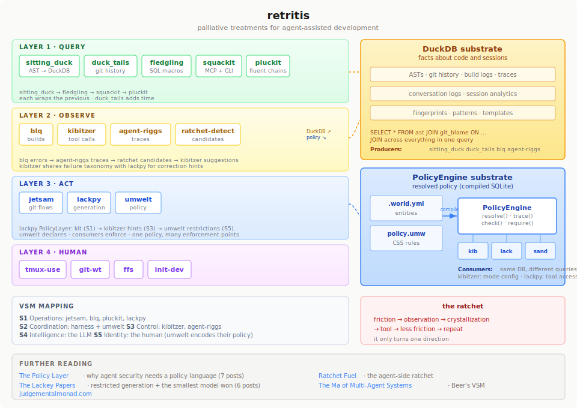

# Retritis

*Retritis* (n.): inflammation caused by repeated retries. A chronic condition of agent-assisted development. No known cure — only palliative treatments.

---

## Diagnosis

You have retritis if:

- You've copy-pasted terminal output into a chat window more than twice today
- You've typed `git add . && git commit -m "wip" && git push` from muscle memory while an agent watches
- You've explained the same codebase structure to three different Claude sessions
- You've lost work to a session crash and reconstructed it by hand
- You've written a bash script to avoid writing a bash script

## Etiology

The condition is occupational. It develops through repeated exposure to the seam between human and agent workflows — the place where structured tools would help but don't exist yet, where context is lost between sessions, where mechanical work consumes attention that should go to the actual problem.

Each tool in this suite addresses a specific symptom. None of them came from a plan. They came from the moment where you think "I've done this enough times." Friction produces signal. Signal crystallizes into a tool. The tool reduces friction. New friction appears at a higher level. Repeat.

This is the ratchet. It only turns one direction.

---

## Pathology



The suite has two shared substrates, both queryable with SQL. [DuckDB](https://duckdb.org) stores facts about code, builds, and sessions — ASTs, git history, build logs, traces, all joinable across tools. [SQLite](https://sqlite.org) stores resolved policy — compiled by [umwelt](https://github.com/teaguesterling/umwelt) from CSS-syntax stylesheets, queried by every consumer through the PolicyEngine API. Neither substrate was an architectural choice made up front. Both fell out of building tools that needed to share structured data without a server.

```
                    ┌─────────────────────────────────────────┐
                    │              DuckDB substrate            │
                    │  ASTs · git history · build logs · traces │
                    └──────┬──────────┬──────────┬────────────┘
                           │          │          │
              ┌────────────┤          │          ├────────────┐
              │            │          │          │            │
         sitting_duck  duck_tails    blq    agent-riggs   umwelt
         (AST query)   (git query) (build)  (traces)     (policy)
              │                       │            │
          ┌───┴───┐              ┌────┴────┐       │
          │       │              │         │       │
       pluckit  fledgling    kibitzer   ratchet    │
       (fluent)  (macros)    (observe)  -detect    │
          │       │                                │
          └───┬───┘                                │
              │              ┌─────────────────────┘
           squackit          │
        (MCP + CLI)      PolicyEngine
                         (SQLite compiled DB)
                              │
               ┌──────────────┼──────────────┐
               │              │              │
           kibitzer       lackpy         sandbox
           (what's      (what ops      (what's
            allowed?)    are legal?)    mounted?)
```

Two substrates, one grammar. The DuckDB layer stores facts about code, builds, and sessions. The SQLite layer (compiled by umwelt) stores resolved policy. Both are queryable with SQL. The tools compose because they share data layers, not because they were designed to compose. blq captures a build failure as a structured event. pluckit can select the failing code using that event as a compound selector. agent-riggs can record the fix as a trace. kibitzer can suggest the pattern next time — and check whether the suggested tool is even allowed by the current policy. The pipeline emerges from the substrates.

---

## Treatment plan

### Layer 1: Query the code

Before you can fix, refactor, or understand anything, you need reliable facts about what the code actually is.

| Tool | What it does | Install |
|------|-------------|---------|
| [sitting_duck](https://github.com/teague/sitting-duck) | CSS selectors over tree-sitter ASTs in DuckDB. 27 languages. The query engine underneath everything else. | `pip install sitting-duck` |
| [fledgling](https://github.com/teague/source-sextant) | SQL macros for definitions, callers, cross-file resolution, structural similarity. | `pip install fledgling` |
| [squackit](https://github.com/teague/squackit) | MCP server + CLI wrapping fledgling with smart defaults, session caching, compound workflows, and token-aware output. The surface most users interact with. | `pip install squackit` |
| [pluckit](https://github.com/teague/pluckit) | jQuery for source code. Fluent chains: select → filter → mutate → test → save. | `pip install pluckit` |
| [duck_tails](https://github.com/teague/duck-tails) | Git history as queryable DuckDB tables. Per-file, per-commit, per-function. | `pip install duck-tails` |

**How they compose:** sitting_duck parses code into ASTs. fledgling adds cross-file query macros. squackit wraps both for agents and humans. pluckit adds a fluent mutation layer on top. duck_tails adds the time dimension. All share the DuckDB substrate — a single query can join AST structure with git history.

### Layer 2: Run and observe

Build, test, and capture what happens. The seam between human and agent: structured results both sides can query.

| Tool | What it does | Install |
|------|-------------|---------|
| [blq](https://github.com/teague/lq) | Build log capture, sandbox presets, structured query. Run builds, query errors, analyze results — all through MCP or CLI. | `pip install blq-cli` |
| [kibitzer](https://github.com/teaguesterling/kibitzer) | Mode-aware tool-call observer. Path protection per mode, bash interception with observe/suggest/redirect ratchet, pattern-based coaching from ~250 experimental runs. Has a full umwelt plugin — registers mode properties (writable, strategy, coaching-frequency, max-turns) and consumes resolved policy via PolicyEngine. Shares a failure mode taxonomy with lackpy for correction hints. | `pip install kibitzer` |
| [agent-riggs](https://github.com/teague/agent-riggs) | Cross-session trace analysis, pattern extraction, template promotion. | `pip install agent-riggs` |
| [ratchet-detect](https://github.com/teague/ratchet-detect) | Analyzes Claude Code conversation logs and finds ratchet candidates. One command, actionable report. | `pip install ratchet-detect` |

**How they compose:** blq captures build events. kibitzer observes tool-use patterns in the current session — with its umwelt plugin, mode configuration (writable paths, strategy text, coaching frequency) comes from the same policy database that controls tool access. agent-riggs analyzes patterns across sessions. ratchet-detect finds the patterns worth promoting. The observation data feeds back into every other layer — blq errors become pluckit selectors, agent-riggs traces become lackpy templates, kibitzer's correction hints feed into lackpy's PolicyLayer through a shared failure mode taxonomy. Observation informed by authorization, correction informed by observation.

### Layer 3: Act on what you know

Git workflows, code generation, policy enforcement.

| Tool | What it does | Install |
|------|-------------|---------|
| [jetsam](https://github.com/teague/jetsam) | Git workflow accelerator. Save, sync, ship. Preview plans before execution. | `pip install jetsam-mcp` |
| [lackpy](https://github.com/teaguesterling/lackpy) | Micro-inferencer that translates natural language intent into sandboxed tool-composition programs. Local 1.5B model, AST-validated, traced execution. Has a PolicyLayer — ordered chain of policy sources (kit baseline → kibitzer coaching → umwelt restrictions) that resolves allowed tools, constraints, and prompt hints before generation. | `pip install lackpy` |
| [umwelt](https://github.com/teaguesterling/umwelt) | CSS-syntax policy engine with vocabulary-agnostic core and built-in SQLite compiler. Selectors + cascade resolve policy per-entity. Each consumer (kibitzer, lackpy, sandbox builders) queries resolved policy through the PolicyEngine API — never touches the parser or compiler directly. Generic context qualifiers let any cross-taxon entity (mode, principal, world) gate a rule. | `pip install umwelt` |

**How they compose:** jetsam handles the git ceremony. lackpy generates sandboxed programs from intent — but before generation, its PolicyLayer resolves what's allowed: the kit provides the baseline tool set (S1), kibitzer adds coaching hints and correction signals (S3), and umwelt provides world-model restrictions (S5). The chain is ordered by priority; each source narrows what the previous allowed. umwelt declares what's allowed and compiles it to SQLite — the PolicyEngine is the consumer-facing API. Each consumer queries its own slice: kibitzer asks "is tool X allowed? what are this mode's writable paths?", lackpy asks "which tools can this program use?", a sandbox builder asks "what mounts are writable?" Same compiled database, different consumers reading different views. One policy, many enforcement points.

### Layer 4: Human-side palliatives

Not everything needs an MCP server. Some symptoms just need a script.

| Tool | What it does |
|------|-------------|
| **tmux-use** | Color-coded terminal session management. Eliminate "which session was I in?" |
| **git-wt** | Git worktree wrapper for structured layouts. Eliminate stash/switch/pop dances. |
| **ffs** | Find Failed Sessions. Crash recovery for Claude Code with runbooks. |
| **init-dev** | Project bootstrapping. Auto-detects project type, sets up fledgling + blq + jetsam. |

---

## The connectivity model

The tools above compose through two shared substrates and one shared grammar. Understanding the connections explains why the suite is more than the sum of its parts.

### Two substrates

```
  DuckDB (facts)                          SQLite (policy)
  ════════════════                        ═══════════════════
                                          ┌─────────────┐
  sitting_duck ──┐                        │ .world.yml  │──┐
  duck_tails  ───┤                        │ policy.umw  │  │
  blq  ──────────┼──→  shared tables      └─────────────┘  │ umwelt
  fledgling  ────┤     (ASTs, git,        ┌─────────────┐  │ compile
  agent-riggs ───┘      builds, traces)   │ PolicyEngine│←─┘
                                          │  (compiled  │
  JOIN across all                         │   .db file) │
  in one query                            └──────┬──────┘
                                                 │ resolve()
                                          ┌──────┼──────┐
                                          │      │      │
                                       kibitzer lackpy sandbox
```

**DuckDB** (facts about code and sessions): sitting_duck parses ASTs. duck_tails imports git history. fledgling adds cross-file query macros. blq captures build events. agent-riggs records traces. All land in the same DuckDB instance — a single query can join AST structure with git blame with test failures.

**SQLite** (resolved policy): umwelt compiles a world file + stylesheet into a SQLite database. The compilation pipeline parses CSS selectors, evaluates them against declared entities, resolves the cascade (specificity + document order), and writes the result to `resolved_properties`. Every consumer reads from this database through the PolicyEngine API.

### One grammar

umwelt uses CSS selectors because they're the best existing grammar for "select entities in a structured world and attach properties to the matches." The same selectors work across taxa:

- `file:glob("src/**/*.py")` — selects files in the world taxon
- `tool#Bash` — selects a tool in the capability taxon
- `mode#review tool.dangerous` — cross-taxon: "when mode is review, for dangerous tools"

Cross-taxon selectors are **context qualifiers** — they gate a rule on a condition from another namespace. The mechanism is generic: `mode#review`, `principal#Teague`, `world#ci` all work the same way. No entity type is special-cased in core.

### Data flows

The DuckDB pipeline: error → understanding → fix → commit → learning.

```
  blq              squackit          pluckit           blq            jetsam
  (capture)        (understand)      (fix)             (verify)       (commit)
     │                 │                │                 │              │
     ▼                 ▼                ▼                 ▼              ▼
  test fails ──→ resolve func ──→ apply chain ──→ re-run tests ──→ commit fix
                 + callers                                              │
                                                                        ▼
                                                                   agent-riggs
                                                                   (record trace)
                                                                        │
                                                              ┌─────────┴──────────┐
                                                              ▼                    ▼
                                                        ratchet-detect        kibitzer
                                                        (find pattern)    (suggest next time)
```

The policy layer: umwelt provides authorization context throughout.

```
  ┌──────────────────────────────────────────────────────┐
  │              umwelt PolicyEngine                      │
  │  .world.yml + policy.umw → compiled SQLite database  │
  └────────┬──────────┬──────────┬──────────┬────────────┘
           │          │          │          │
       engine.    engine.    engine.    engine.
       check()   resolve()  resolve    trace()
           │          │     _all()        │
           ▼          ▼          │        ▼
       kibitzer   kibitzer      ▼     audit trail
       "is Bash   "mode has   lackpy   "rule 2
        allowed?"  writable:  "which    won at
                   src/"      tools?"   spec 0,1,1"
```

### The three integration patterns

**1. PolicyEngine (pull model):** umwelt declares, consumers enforce. The consumer queries resolved policy on demand:

```python
from umwelt.policy import PolicyEngine

engine = PolicyEngine.from_db("compiled.db")
engine.resolve(type="tool", id="Bash", property="allow")
```

kibitzer uses this pattern — its `PolicyConsumer` wraps a PolicyEngine and provides mode-specific queries (`get_mode_policy`, `get_tool_policy`, `list_modes`). It also registers its own vocabulary (writable paths, coaching frequency, max-turns) so policy authors configure kibitzer through the same `.umw` stylesheets.

**2. PolicyLayer (chain model):** lackpy's ordered resolution chain composes multiple policy sources:

```
  ┌───────────┐     ┌────────────────┐     ┌─────────────────┐
  │    Kit    │     │   Kibitzer     │     │    Umwelt       │
  │   (S1)    │────▶│    (S3)        │────▶│    (S5)         │────▶ PolicyResult
  │           │     │                │     │                 │
  │ tools     │     │ + hints        │     │ - denied tools  │     allowed_tools
  │ physically│     │ + doc context  │     │ - constraints   │     prompt_hints
  │ available │     │ + corrections  │     │   (max-level,   │     tool_constraints
  │           │     │ (never narrows │     │    patterns)    │
  │           │     │  tool access)  │     │                 │
  └───────────┘     └────────────────┘     └─────────────────┘
  priority: 10       priority: 50           priority: 100
                     can only ADD hints     can only NARROW access
```

Each source can narrow what the previous allowed; none can widen. The kit provides the ground truth (what tools are physically available), kibitzer adds coaching (never modifies tool access), and umwelt provides authoritative restrictions from the world model.

**3. Shared taxonomy (vocabulary model):** kibitzer and lackpy share a failure mode taxonomy. Each failure category maps to a specific prompt intervention:

```
  lackpy generates program
         │
         ▼
  validation fails ──→ classify failure mode
         │                     │
         │              ┌──────┴───────────────────────────┐
         │              │  7 shared failure categories:     │
         │              │                                   │
         │              │  implement_not_orchestrate        │
         │              │    → "ORCHESTRATE, DO NOT         │
         │              │       IMPLEMENT"                  │
         │              │  stdlib_leak                      │
         │              │    → "Do NOT use open(). Use      │
         │              │       read_file()"                │
         │              │  path_prefix                      │
         │              │    → "All paths relative to       │
         │              │       workspace root"             │
         │              │  key_hallucination                │
         │              │    → document return schema       │
         │              │       in namespace_desc           │
         │              │  ...                              │
         │              └──────┬───────────────────────────┘
         │                     │
         ▼                     ▼
  next generation ◀──── correction hints
  attempt                (prompt_hints + doc_context)
```

When lackpy's generated program fails validation, kibitzer classifies the failure mode and returns correction hints that feed back into the next generation attempt.

Multiple consumers can read the same compiled database simultaneously, each querying its own slice. The compiled database is the shared artifact — not an API, not an event bus, just a SQLite file.

---

## A day in treatment

What an actual work session looks like — not a polished demo, but the messy reality of how these tools compose.

### Morning: starting a feature

`tmux-use` opens the project session. `git-wt` creates a worktree for the feature branch — isolated from main. `init-dev` already ran when the project was created, so blq, fledgling, and jetsam are configured.

Describe the feature to Claude. Claude uses squackit to understand the code — `find_definitions` for entry points, `find_callers` to map the blast radius, `code_structure` for an overview. Thirty seconds, reliable map. Without it, Claude would grep around for a few minutes and build a less accurate picture.

### Midday: building

You're editing code. Claude is editing code. Same worktree, different files.

Claude runs tests through blq: `blq run test`. You can see the results too — `blq errors` shows failures, `blq output` shows the full log. If Claude gets stuck, you check `blq errors` yourself, see the same structured data, and give specific guidance. No copy-pasting. No "can you show me the full output?" The shared tool is the shared context.

kibitzer fires periodically. "You've made 5 edits without running tests." Sometimes useful. Sometimes ignored. The observations log either way — follow rates tell you which suggestions are actually helpful.

### Afternoon: integration

The feature works. `jetsam save 'feat: add timeout parameter'` — preview shows 4 files staged, commit message generated from the diff. Confirm. `jetsam sync` rebases on main. `jetsam ship` opens the PR.

If agent-riggs is active, the session trace is already analyzed: which tool sequences were effective, which patterns repeated, which could be promoted to templates. Next time someone does a similar feature, the tooling is slightly more prepared.

### The accumulation

No single tool here is impressive. Session management? Worktree wrappers? A build log viewer? Each one is a small thing.

But the accumulation changes what kind of work is possible. You don't think about terminal layout. You don't think about branch switching. You don't think about how to share build results with Claude. You don't think about crash recovery. Each tool removed one friction point, and the freed attention compounds.

---

## The ratchet underneath

The suite has a theoretical frame: Stafford Beer's [Viable System Model](https://en.wikipedia.org/wiki/Viable_system_model) (VSM). Every viable system — biological, organizational, or computational — needs the same five functions. The retritis suite maps to them:

| VSM | Function | Retritis tool |
|-----|----------|--------------|
| **S1** Operations | The tools that do the work | jetsam (git), blq (build), pluckit (code mutation), lackpy (generation + PolicyLayer) |
| **S2** Coordination | Routes messages, enforces permissions | The harness (Claude Code) + plugin hooks + umwelt (compiled policy via PolicyEngine) |
| **S3** Control | Watches trajectory, allocates resources, adjusts configuration | kibitzer (in-session, umwelt plugin for mode policy), agent-riggs (cross-session) |
| **S3*** Audit | Observes operations directly | blq (build audit), fledgling (conversation audit), ratchet-detect |
| **S4** Intelligence | Environmental scanning, adaptation | The LLM itself |
| **S5** Identity | What the system is for, whose values it serves | The human. umwelt encodes their policy |

Current agent architectures have S1, S4, S5 — but only partial S2 and S3. The coordination function is limited to the harness's built-in permission model (hooks, allowlists); the control function is performed manually by the human or not at all. Retritis fills both gaps: umwelt provides declarative, auditable coordination (S2) — a policy compiled once and enforced at every tool boundary — while kibitzer and agent-riggs provide the observation and adjustment loop (S3).

The observation tools (S3/S3\*) produce structured data. The ratchet mechanism promotes repeated patterns from observations to templates to tools. Each promotion removes a friction point and frees attention for higher-level work. The ratchet only turns one direction: things that work get crystallized; things that don't get observed and eventually addressed.

```
friction → observation → crystallization → tool → less friction → repeat
    ↑                                                              │
    └──────────────────────────────────────────────────────────────┘
```

---

## Claude Code Plugins

The quickest way to start treatment. Install the plugin marketplace, then pick your prescriptions.

```bash
# Add the retritis pharmacy
/plugin marketplace add teaguesterling/retritis

# Fill prescriptions individually
/plugin install blq@retritis
/plugin install jetsam@retritis
/plugin install fledgling@retritis
/plugin install squackit@retritis
/plugin install kibitzer@retritis
```

Each plugin bundles:

- **MCP server config** — tool availability, no manual `.mcp.json` editing
- **Skills** — routing instructions ("instead of grep, use find_definitions")
- **Hooks** (optional) — gentle warnings when you reach for bash instead of the structured tool

### What a plugin looks like

```
plugins/<name>/
  .claude-plugin/plugin.json      — manifest (name, description, version)
  .mcp.json                       — MCP server config
  skills/<name>-workflow/SKILL.md  — routing table + tool reference
  hooks/                          — optional
    hooks.json                    — hook registration
    <name>-warn.sh                — hook script
```

### Prerequisites

Each tool is its own package. The plugin just wires it into Claude Code.

```bash
pip install blq-cli          # blq
pip install jetsam-mcp       # jetsam
pip install fledgling        # fledgling
pip install squackit         # squackit
pip install kibitzer         # kibitzer
```

### Quick start

```bash
# 1. Install the core tools
pip install blq-cli jetsam-mcp fledgling squackit

# 2. Add the plugin marketplace
/plugin marketplace add teaguesterling/retritis

# 3. Install plugins
/plugin install blq@retritis jetsam@retritis fledgling@retritis squackit@retritis

# 4. Bootstrap your project
init-dev    # auto-detects project type, configures tools

# 5. Start working
claude      # tools are available immediately
```

---

## Clinical examples

See **[EXAMPLES.md](EXAMPLES.md)** for seven case studies showing how the tools compose in practice: bug diagnosis, blast-radius refactoring, self-fixing errors, codebase tours, unified policy, crash recovery, and teaching a model your API.

---

## Prognosis

There is no cure. The condition is progressive — each tool you build reveals new friction, which produces new tools. This is by design. The ratchet only turns one direction.

The good news: the symptoms become manageable. A year ago, half my time with Claude was infrastructure — setting up the environment, sharing context, recovering from crashes, managing git state. Now that's handled. The freed attention compounds.

The bad news: you will name things like "retritis" and think it's funny.

---

## Further reading

- [judgementalmonad.com](https://judgementalmonad.com) — The blog series behind the suite
- [The Policy Layer](https://judgementalmonad.com/blog/policy/) — Why agent security needs a policy language, how CSS selectors + cascade resolve it, the seven authorization axes, and why umwelt uses the syntax it does (7 posts)
- [The Lackey Papers](https://judgementalmonad.com/blog/tools/lackey/) — The Ma framework at micro scale: tool-call composition, restricted code generation, and why the smallest model won (6 posts)
- [The Tools That Built Themselves](https://judgementalmonad.com/blog/tools/the-tools-that-built-themselves) — How and why these tools exist
- [Ratchet Fuel](https://judgementalmonad.com/blog/fuel/index) — The agent-side ratchet mechanism
- [The Ma of Multi-Agent Systems](https://judgementalmonad.com/blog/ma/index) — Beer's VSM applied to agent architecture
- [An LLM Is a Subject of Your Policy](https://judgementalmonad.com/drafts/an-llm-is-a-subject-of-your-policy) — Why authorization needs new axes

## License

MIT
